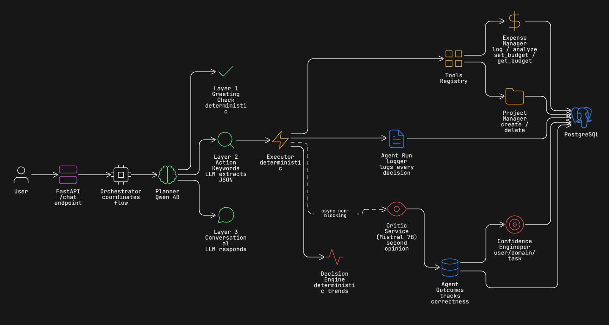
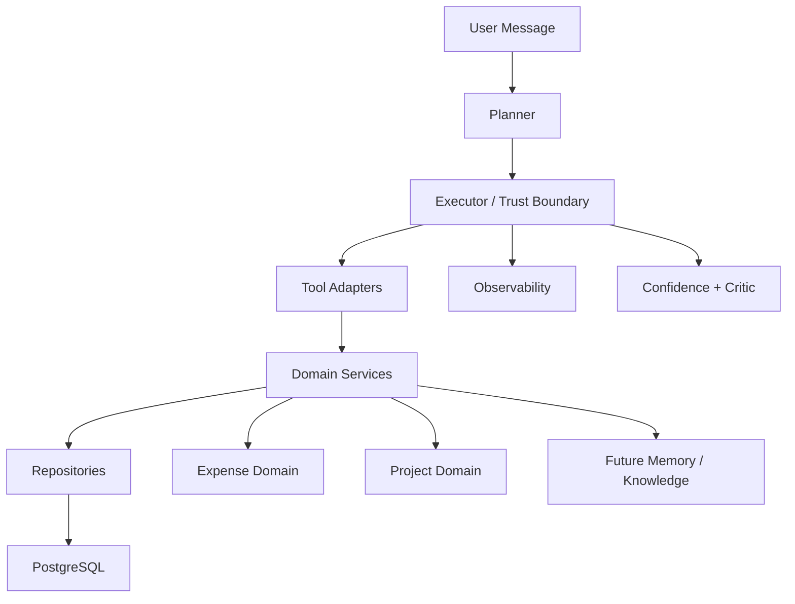

# RUX - AI Orchestration Engine

> A local AI orchestration backend that turns natural language into safe, persistent state changes with validation, observability, feedback, and critique.

## Architecture Snapshot






## Status

RUX is under active development and is currently being refactored toward a more modular domain-based architecture.

## What RUX Is

Most toy agents look like this:

```text
LLM -> tool -> response
```

RUX is built around a stronger runtime contract:

```text
User
 -> Planner
 -> Executor (trust boundary)
 -> Tool Adapter
 -> Domain Service
 -> Repository
 -> PostgreSQL
 -> Observability / Outcome Tracking / Critique / Confidence
 -> Final Response
```

The core idea is simple: the LLM is not trusted. Anything before the executor is probabilistic. Anything after schema validation is expected to be deterministic, auditable, and safe to reason about.

## Core Ideas

- **Trust boundary**: planner output is treated as untrusted until it passes schema validation.
- **Thin tools**: tools translate validated params into domain service calls.
- **Domain-first structure**: business behavior lives inside domains, not inside runtime glue.
- **Observable execution**: runs and outcomes are logged for inspection and feedback.
- **Confidence from history**: confidence is derived from past correctness, not model self-reported certainty.
- **Critique as a second layer**: decisions can be reviewed independently instead of trusting a single model pass.

## Current Domains

- **Expense**: expense logging, budget enforcement, spend analysis
- **Project**: project creation and deletion flows
- **In progress**: modular runtime cleanup, hybrid memory direction, future knowledge layer

## Current Structure

```text
rux/
├── api/                # FastAPI routes
├── core/               # current runtime layer
├── domains/
│   ├── expense/
│   └── project/
├── repositories/       # shared persistence adapters
├── services/           # shared services + some legacy files
├── memory/             # legacy memory path, planned for refactor
├── tests/
├── database.py
├── models.py
└── main.py
```

## Response Model

RUX is moving toward a shared internal tool contract:

- `ToolResponse.status`
- `ToolResponse.message`
- `ToolResponse.data`
- `ToolResponse.error`
- `ToolResponse.metadata`

This makes tool execution easier to validate, log, test, and later route cleanly through the executor.

## Tech Stack

- Python
- FastAPI
- SQLAlchemy async ORM
- PostgreSQL
- Pydantic
- Local LLM serving via LM Studio

## Setup

```bash
# Clone
git clone https://github.com/rahulT-17/RUX-AI-Companion.git
cd RUX-AI-Companion

# Create virtual environment
python -m venv .venv

# Activate (PowerShell)
.\.venv\Scripts\Activate.ps1

# Install dependencies
python -m pip install -r requirements.txt

# Initialize database tables
python init_db.py

# Run the API
python -m uvicorn main:app --reload
```

## What Works Now

- planner -> executor -> domain tool flow
- expense logging and budget enforcement
- project creation and deletion
- database-backed persistence
- execution logging and feedback-oriented infrastructure
- smoke tests for expense and project tool adapters

## Roadmap

- [ ] Make the executor consume `ToolResponse` end-to-end
- [ ] Unify confirmed actions with the normal execution pipeline
- [ ] Remove legacy duplicated service/repository files
- [ ] Build hybrid memory: short-term, episodic, semantic retrieval
- [ ] Add a knowledge layer for reusable facts, concepts, and sources
- [ ] Improve deployment and production config hygiene

## Why I Built This

I built RUX to understand what actually breaks in AI agent systems when you move past demos: unreliable tool calls, weak trust boundaries, missing feedback loops, and no real way to measure correctness over time.

The goal is not to build another chatbot wrapper. The goal is to build the runtime layer underneath an AI agent system: validation, orchestration, observability, critique, and eventually memory and knowledge.

---

*Built as a learning project. Actively evolving.*
